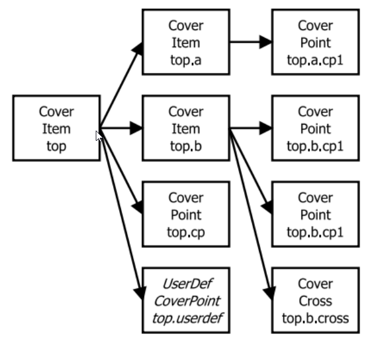

############
Introduction
############

Functional Coverage in SystemVerilog
====================================

In SystemVerilog a fundamental coverage unit is a *coverpoint*.
It contains several bins and each bin may contain several values.
Every *coverpoint* is associated with a variable or signal.
At sampling event, the *coverpoint* variable value is compared with each defined bin.
If there is a match, then the number of hits of the particular bin is incremented.
*Coverpoints* are organized in *covergroups*, which are specific class-like structures.
A single *covergroup* may have several instances and each instance may collect coverage independently.
A *covergroup* requires sampling, which may be defined as a logic event (e.g. a positive clock edge).
Sampling may also be called implicitly in the testbench procedural code by invoking a *sample()* method of the *covergroup* instance.
SVA (SystemVerilog Assertions) syntax may be used to build advanced sequences containing repetitions,
multi-stage successions or wildcard transitions.
A bin may be also defined as an *ignore_bins*, which means its match does not increase a coverage count,
or an *illegal_bins*, which results in error when hit during the test execution.

Another coverage construct in SystemVerilog is a *cross*.
It automatically generates a Cartesian product of bins from several *coverpoints*.
It is a useful feature simplifying the functional coverage generation.
As it may be difficult or unnecessary to cover all the cross-bins,
some of them may be excluded from the analysis.
This is possible using the *binsof ... intersect* syntax.

The most important limitations of the SystemVerilog functional coverage features are:

- straightforward bins matching criteria – only satisfied by equality or inclusion relation;
- bins may be only constants or transitions (possibly wildcard);
- flat coverage structure – cover groups cannot contain other cover groups,
  which would correspond better to a verification plan scheme;
- not possible to get the detailed coverage information in real time (e.g. when a specific bin was hit).

Functional Coverage with cocotb-coverage
========================================

The general assumptions for the architecture of the functional coverage features are as follows:

- functional coverage structure should better match a real verification plan;
- its syntax should be more flexible, but a separation between coverage and executable code should be maintained;
- features for analysing the coverage during test execution should be added or extended;
- coverage primitives should be able to monitor testbench objects at a higher level of abstraction.

The implemented mechanism is based on the idea of decorator design pattern.
In Python, a decorator syntax is readable and easy to use.
Instead of sampling coverage items by an additional method, decorators are
by default invoked at each decorated function call.
As it is easy to create functions in Python
(for example anonymous functions can be created as `lambda expressions<lambda>` –
single-line function definitions), this is a convenient solution.
The coverage structure is based on a prefix tree (a *trie*).
The main coverage primitive is a `CoverItem`, which corresponds to a SystemVerilog covergroup.
`CoverItem` may contain other `CoverItems<CoverItem>` or objects extending `CoverItems<CoverItem>` base class,
which are `CoverPoints<CoverPoint>`, `CoverCrosses<CoverCross>` or arbitrary new, user-defined types.
`CoverItems<CoverItem>` are created automatically,
the user defines only `CoverPoint` or `CoverCross` primitives (the lowest level nodes in the trie).
Each created primitive has a unique ID – a dot-separated string.
This string denotes the position of an object in the coverage trie.
For example, a `CoverPoint` *a.b.c* is a member of the *a.b* `CoverItem`,
which is then a member of the *a* `CoverItem`.

The structure of the coverage trie is presented below.

.. _coverstruct:

   An example of the coverage trie structure

A `CoverPoint` decorator functionality corresponds to a *coverpoint* in SystemVerilog.
It checks whether the arguments of a decorated function match the predefined bins.
In a simple case, variables equality to the bins is checked.

Additionally, it is possible to define:

- a **transformation function**, which transforms the arguments of a decorated function
  and the transformation result is compared to the bins,
- a **relation function**, which defines the binary relation of bin comparison
  (which by default is the equality operator).

Bins in the `CoverPoint` may be a list of arbitrary objects which are hashable.
In Python they are constants, tuples or even functions.
In general, the bins matching condition can be described by a formula:

.. centered:: ``relation(transformation(arguments), bin) is True``

A `CoverCross` decorator functionality corresponds to a cross in SystemVerilog.
Its main attributes are a list of items (`CoverPoints<CoverPoint>`),
a list of bins to be ignored and an optional ignore relation function.
`CoverCross` bins are tuples generated as a Cartesian product of bins from `CoverPoint` items.
An item in (`ign_bins`) may contain a ``None`` object which corresponds to
*binsof ... intersect* syntax, meaning a specific `CoverPoint` bin value may be a wildcard.

An example below presents the same coverage implementation in SystemVerilog and in Python.
As the `CoverPoint` *length* bins contain value range,
a relation must be defined in the Python implementation, which uses a tuple (in this case a pair)
and finds out whether the variable is within a given range.

.. list-table::

   * - .. code-block:: systemverilog
          :caption: Original SystemVerilog code

          covergroup transfer;
            direction : coverpoint dir {
                bins read  = {0};
                bins write = {1};
            }
            length : coverpoint length {
                bins short = {[1:10]};
                bins long  = {[10:100]};
            }
            type : coverpoint type {
                bins type_a = {A};
                bins type_b = {B};
            }
            tr_cross : cross
                direction, length, type {
                ignore_bins ign = binsof(type) intersect {A};
            }

     - .. code-block:: python
          :caption: Equivalent Python code

          @CoverPoint ("transfer.direction" ,
              xf = lambda xfer: xfer.dir,
              bins = [0, 1]
          )
          @CoverPoint ("transfer.length",
              xf = lambda xfer.length,
              bins = [(1, 10), (10, 100)],
              rel = lambda val, b: b(0) <= val <= b(1)
          )
          @CoverPoint("transfer.type",
              xf = lambda xfer.type,
              bins = [A, B]
          )
          @CoverCross("transfer.tr_cross",
              items = ["transfer.direction",
                       "transfer.length",
                       "transfer.type"],
              ign_bins = [(None, None, A)]
          )
          def decorated_function(xfer):
              ...

More complex examples of coverage mechanisms are presented below.
The *coverage.transition* defines a transformation by a *transition_inta()* function.
This function returns a tuple containing the previous and the current value of *inta*.
It is a simple example of the transition bins.
The *coverage.primefactors* defines a relation by a function *has_prime_factor()*
checking if a bin value is a prime factor of *inta*.
The `inj` attribute is set ``True``, which means that more than one bin can be matched at a single sampling.
For example, an *inta* value of 30 matches bins ``2``, ``3``, and ``5``.
The *coverage.tuple* presents how arbitrary hashable type may be used as a bins.
The bins are predefined in a simple bins list containing 40 elements of *(int, string)* pairs.
The *coverage.check* is an example of a higher-level assertion.
This is a new defined coverage primitive which checks whether the *string* variable is not empty.
If at least one empty string is sampled, coverage level is forced zero.

.. code-block:: python

   simple_bins = []  # bins generation for coverage.tuple: create a 40-elements list
   for i in range(1, 21):  # for i=1 to 20
       simple_bins.extend([(i, 'y'), (i, 'n')])  # extend list by two elements - tuples(int, str)

   # transition function for coverage.transition
   prev_value=0  # previous value defined outside the function (global variable)
   def transition_inta(inta, intb, string):  # function definition
       transition = (prev_value, inta)  # transition as a tuple of(int, int)
       prev_value = inta  # update previous value
       return transition

   # sampling function and its coverage decorators
   @CoverPoint("coverage.transition", xf=transition_inta, bins=[(1, 2), (2, 3), (3, 4)])
   @CoverPoint("coverage.primefactors",xf=lambda inta, intb, string: inta,
       rel=has_prime_factor, inj=True, bins=[2, 3, 5, 7, 11, 13, 17])
   @CoverPoint("coverage.tuple", xf=lambda inta, intb, string: (inta+intb, string),
       bins=simple_bins)
   @CoverCheck("coverage.check",f_fail=lambda inta, intb, string: string == "")
   def decorated_function(inta, intb, string):
       ...

There are some higher-level functions available for `CoverItems<CoverItem>`.
They can be used in real time in the testbench, which allows for processing coverage data dynamically.
It is possible to easily get the coverage data from each primitive or define a callback,
called when coverage level has been exceeded or a specific bin was hit.
Callbacks may be used in order to adjust a test scenario when specific coverage goal has been achieved.
Instead of monitoring the coverage during the test execution,
a callback function will be called automatically.
A callback function may be simply appended to any `CoverItem` primitive by the testbench designer.

.. note::
   More information about functional coverage background and this implementation can be found in

   M. Cieplucha and W. Pleskacz,
   "New architecture of the object-oriented functional coverage mechanism for digital verification,"
   in *2016 1st IEEE International Verification and Security Workshop (IVSW)*, July 2016, pp. 1–6.

Constrained Random Verification Features in SystemVerilog
=========================================================

SystemVerilog users may define random variables using the *rand[c]* modifier.
Calling *randomize()* function on a class instance (object) results in
picking random values of the defined random variables, satisfying given constraints.
Also a *with* modifier can be used together with *randomize()* which allow for
appending additional constraints dynamically.
Constraints are defined in a special section in the class named *constraint*.
They describe a range values that a single variable may have or a relation between variables.
It is also possible to define solution ranges with weights (using *dist* modifier).
The *solve ... before* is an additional construction which organizes variable randomization order.

Constraints are unique constructs of SystemVerilog.
They are class members, but they are not functions or objects.
Basic operations can be performed on constraints, such as enable/disable or inheritance.
Soft constraints have been introduced in SystemVerilog 2012.
They are resolved only when it is possible to satisfy them together with all other hard constrains.
Every SystemVerilog simulator must implement a constraint solver.
Although many open-source constraint solvers are available,
testbench designers cannot use them, as they have no control over the simulator engine.
The most important limitations of the existing constrained randomization features
are related to their fixed syntax.

In cocotb-coverage, it is assumed that a constraint may be any callable object –
an arbitrary function or a class with ``__call__`` method.
It allows for creating various functionalities quite easily and manipulating them in a flexible way.

Constrained Random Verification Features in cocotb-coverage
===========================================================

The main assumption for the constrained randomization features was to provide only a flexible API,
and let the testbench designer to adjust it depending on project needs.
There is a default open-source based hard constraint solver
(`python-constraint <https://github.com/python-constraint/python-constraint>`_)
but it can be replaced by the end user if required.
The general idea of cocotb-coverage is that all classes that intended
to use randomized variables should extend the base class `Randomized`.
Afterwards, random variables and their ranges should be defined.
Constraints are just arbitrary functions with only one requirement:
their argument names must match class member names.
It is possible to define two types of constraints:

- functions that return a ``True``/``False`` value, corresponding to SystemVerilog hard constraints;
- functions that return a numeric value, corresponding to a variables distribution
  (or cross-distribution) which also may be used as soft constraints.

The full `Randomized` class API consists of the following functions:

- `add_rand(var, domain)<add_rand>` - specifies var as a randomized variable taking values from the domain list;
- `add_constraint(cstr)<add_constraint>` - adds a constraint function to the solver;
- `del_constraint(cstr)<del_constraint>` - removes a constraint function from the solver;
- `solve_order(vars0, vars1 ...)<solve_order>` - optionally specifies the order of randomizing variables (can be used for problem
  decomposition or in case some random variables must be fixed before randomizing the others);
- `pre_randomize` - function called before `randomize`/`randomize_with`, corresponding to similar function in SV;
- `post_randomize` - function called after `randomize`/`randomize_with`, corresponding to similar function in SV;
- `randomize()` - main function that picks random values of the variables satisfying added constraints;
- `randomize_with(cstr0, cstr1 ...)<randomize_with>` - similar to `randomize()`, but satisfies additional given constraints.

..
  TODO: add an equivalence table

The example below presents the corresponding implementation of the randomized class with use of hard
constraints.

.. list-table::

   * - .. code-block:: systemverilog
          :caption: Original SystemVerilog code

          class rand_frame;
              typedef enum {SMALL, MED, BIG } size_t;
              rand logic [15:0] length;
              rand logic [15:0] pld;
              rand size_t size;
              constraint frame_sizes {
              if (size==MED) {
                  length >= 64;
                  length < 2000;
              } else if (size==SMALL) {
                  length > 0;
                  length < 64;
              } else if (size==BIG) {
                  length >= 2000;
                  length < 5000;
              }
                  pld < length;
                  pld % 2 == 0;
              }
          endclass

     - .. code-block:: python
          :caption: Equivalent Python code

          class rand_frame(crv.Randomized):
              def __init__(self):
                  crv.Randomized.__init__(self)
                  self.length = 0
                  self.pld = 0
                  self.size = "SMALL"
                  self.add_rand("size", ["SMALL", "MED", "BIG"])
                  self.add_rand("length", list(range(1, 5000)))
                  self.add_rand("pld", list(range(0, 4999)))
                  def frame_sizes(length, size):
                      if (size=="SMALL") length < 64
                      elif (size=="MED") 64 <= length < 2000
                      else length >= 2000
                  self.add_constraint(frame_sizes)
                  self.add_constraint(
                      lambda length, pld: pld < length
                  )
                  self.add_constraint(lambda pld: pld % 2 == 0)

A more complex example is presented below. The class ``TripleInt`` contains three unsigned integer members,
*y* and *z* are randomized.
The first defined constraint combines all variables (random and non-random).
The second constraint defines a triangular distribution for variable *z*.
It is achieved by defining a function that has its maximum in the middle of the variable range (for solution *z = 500*).
The third one is a cross-distribution of variables *y* and *z*.
The weight function defines higher probability for solutions with higher difference between both variables.
The last one is a kind of a soft constraint –
very low probability is set for condition *x > y*,
which means that solutions satisfying *x ≤ y* will be strongly preferred.

.. code-block:: python

   class TripleInt(crv.Randomized):
       def __init__(self, x):
           crv.Randomized.__init__(self)
           self.x = x  # this is a non-random value, determined at class instance creation
           self.y = 0
           self.z = 0
           add_rand(y, list(range(1000)))  # 0 to 999
           add_rand(z, list(range(1000)))  # 0 to 999
           add_constraint(lambda x, y, z: x+y+z==1000)          # hard constraint
           add_constraint(lambda z: 500 - abs(500-z))           # triangular distribution of z variable
           add_constraint(lambda y, z: 100 + abs(y-z))          # multi-dimensional distribution
           add_constraint(lambda x, y: 0.01 if (y > x) else 1)  # soft constraint

It is assumed that only one hard constraint and one distribution may be associated with
each set of random variables.
So, for the example presented above, it is possible to define no more than six constraint functions:
separately for variables *y* and *z* and both *(y and z)*.
It means that constraints may be overwritten, for example by `randomize_with()` function arguments.

Methodology Example - Basic Test
================================

This section presents a basic test demonstrating how the provided mechanisms can be used.
The DUT is a simple module calculating the mean value of *bus_width* inputs, each of size *data_width* bits.
The verification goal of the test is to achieve 100% functional coverage.
The coverage monitors data values on the first and last input buses
and we expect to cover the whole data range of both of them.

The ``StreamTransaction`` class defines a random variable *data*,
which is a list of tuples of all possible data combinations.
In the ``StreamBusDriver`` we define a functional coverage inside driver's *send* function.
Data on the first (``0``) and last (``bus_width-1``) input bus is monitored using two `CoverPoints<CoverPoint>`.
The main test function *mean_mdv_test()* checks the data using a scoreboard and performs the main while loop.
The loop checks the coverage level and sends the randomized transaction to the DUT satisfying a given constraint.
To speed up the verification closure the constraint prevents the random data
(that has already been covered) from being generated again.

.. code-block:: python

    class StreamTransaction(crv.Randomized):
        ...
        def __init__(self, bus_width, datawidth):
        ...
        list_data = range(0, 2**data_width)  # a list of all possible data (0, 1...2^data_width-1)
        # generate the Cartesian product of tuples of all possible input combinations
        # e.g. (0, 0), (0, 1)...(2^data_width-1, 2^data_width-1) for bus_width = 2,
        #      (0, 0, 0)...(2^data_width-1, 2^data_width-1, 2^data_width-1) for bus_width = 3 etc.
        combinations = list(itertools.product(list_data, repeat=bus_width))
        self.add_rand("data", combinations)

    class StreamBusDriver(BusDriver):
        ...
        @cocotb.coroutine
        def send(self, transaction):
            ...
            @cocotb.coverage.CoverPoint("top.data1", xf=lambda transaction: transaction.data[0],
                bins=range(0, 2**transaction.data_width))
            @cocotb.coverage.CoverPoint("top.dataN",
                xf=lambda transaction: transaction.data[transaction.bus_width-1],
                bins=range(0, 2**transaction.data_width))
            def sample_coverage(transaction):
                pass
            sample_coverage(transaction)

    @cocotb.test()
    def mean_mdv_test(dut):
        dut_out = StreamBusMonitor(dut, "o", dut.clk)  # DUT outputs Monitor
        dut_in = StreamBusDriver(dut, "i", dut.clk)  # DUT inputs Driver
        exp_out = []
        scoreboard = Scoreboard(dut)  # Scoreboard compares DUT output with exp_out list content
        scoreboard.add_interface(dut_out, exp_out)
        ...
        # a constraint function: do not pick values that have been already covered
        def data_constraint(data):
            return (not data[0] in coverage1_hits) & (not data[bus_width-1] in coverageN_hits)

        coverage=0
        xaction=StreamTransaction(bus_width, data_width)  # create transaction instance
        while coverage<100:
            # observe newly hit bins after each transaction
            coverage1_new_bins = coverage.coverage_db["top.data1"].new_hits
            coverageN_new_bins = coverage.coverage_db["top.dataN"].new_hits
            coverage1_hits.extend(coverage1_new_bins)
            coverageN_hits.extend(coverageN_new_bins)
            xaction.randomize_with(data_constraint)  # randomize transaction
            yield dut_in.send(xaction)  # execute transaction on Driver
            exp_out.append(xaction.mean_value())  # calc mean value and send result to theS coreboard
            # calculate the current coverage level
            coverage = coverage.coverage_db["top"].coverage*100/coverage.coverage_db["top"].size

For ``data_width = 6`` the simulation time was about 5 times shorter than without this constraint.
For ``data_width = 8`` the difference is about 10 times.
This basic demonstration shows the flexibility and ease of use of the presented MDV and CRV features.
The implementation of a similar test scenario in SystemVerilog would be much more complicated.

Conclusion
==========

The presented approach for MDV and CRV techniques using Python shows many benefits
over similar verification strategy using HVLs.
First of all, the simulator is performing only RTL simulations, it is not required to support HVLs.
It means that, for example, open source simulators can be used with cocotb for complex verification tasks.
The presented functional coverage features allow for a higher level of
abstraction objects to be monitored and tracked.
The coverage structure also better matches a real verification plan.
That shortens the gap between a verification plan structure and functional coverage implementation.
The described CRV features demonstrate higher flexibility than fixed HVLs syntax.
Finally, due to Python's syntax clarity, composing programs that use
the presented mechanisms together is straightforward.

The only issue not discussed in this paper is performance.
Python, as an interpreted language has no excellent performance results.
This is however a relatively minor issue, as most of the complexity
of the functional verification task is the DUT RTL simulation.
Nevertheless, a VPI implementation differs between simulators and they may
demonstrate different performance capabilities.
